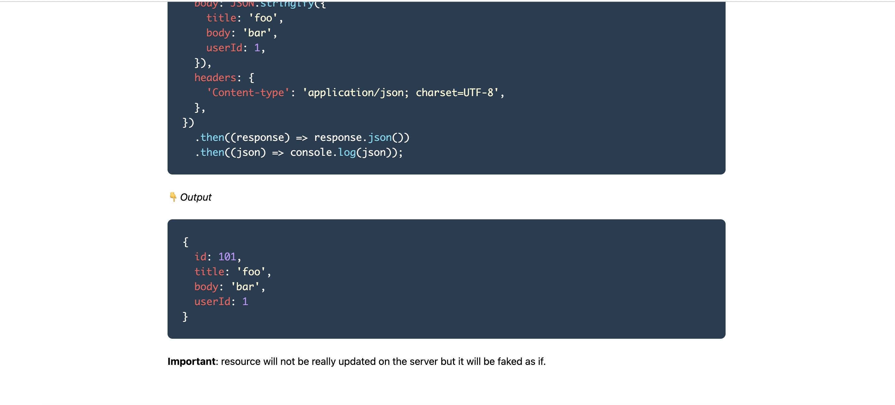

# My React TypeScript App

## About This App

This application is built using React, TypeScript, and TailwindCSS. It fetches data from an external API and displays it with options to filter and paginate results. The main features include searching by email or any text within the data, and adjusting the number of items displayed per page.

## Data Source

The application fetches data from the following API endpoint:

```
https://jsonplaceholder.typicode.com/comments
```

## Setup Instructions

To get started with this app, follow these steps:

1. Ensure you have Node.js installed (the application is tested with v18.19.1).
2. Install the necessary packages using:
   ```
   npm install
   ```
3. Start the application:
   ```
   npm start
   ```

## Additional Packages

- **lodash**: A modern JavaScript utility library delivering modularity, performance, & extras.
- **react-tooltip**: A flexible tooltip component for React, useful for adding rich hover explanations.
- **react-tostify**: React-Toastify allows you to add notifications to your app with ease. No more nonsense!

## Additional Information

When performing create and delete operations, the JSONPlaceholder API responds with a status code of 200 but actually doesn't gets updated. This behavior is consistent across the API, and in our application, we display this status as a toast message to inform the user of successful operations.

For more clarity on this behavior, you can refer to the discussion on the JSONPlaceholder GitHub repository:
[Issue #19](https://github.com/typicode/jsonplaceholder/issues/19)


